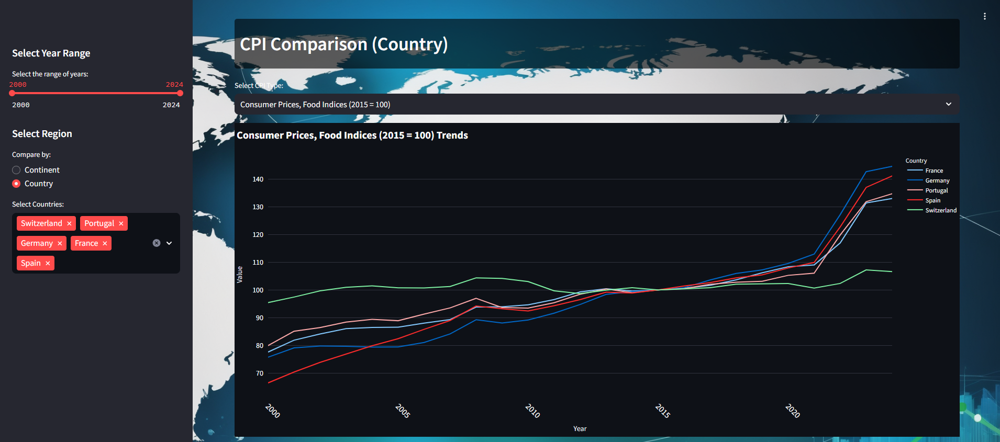

# Global Consumer Price Index Explorer

## Overview

The **Global Consumer Price Index Explorer** is an interactive web application that provides insights into the global Consumer Price Index (CPI) trends using data visualizations. Built with [Streamlit](https://streamlit.io/) and [Plotly](https://plotly.com/), the app allows users to explore and visualize CPI data from various countries over time.

## Features

- **Data Visualization**: Interactive plots using Plotly to analyze Consumer Price Index trends globally.
- **Custom Background**: An aesthetically pleasing interface with a custom background image.
- **Efficient Data Caching**: Uses Streamlit's caching mechanism to efficiently load data.

## How to Use

1. **Access the App**: Visit the 

2. **Interact with the App**: 
   - Explore Consumer Price Index data using interactive charts.
   - Customize the view by selecting specific countries or date ranges.
   - The app provides real-time visual feedback on the selected data.

## Tech Stack

- **Streamlit**: For building the web application.
- **Pandas**: For data manipulation and analysis.
- **Plotly**: For creating interactive visualizations.
- **Python**: The core programming language for development.

## Data Source
The data used in this project comes from the [Food and Agriculture Organization (FAO) Consumer Price Index dataset](https://www.fao.org/faostat/en/#data/CP).
